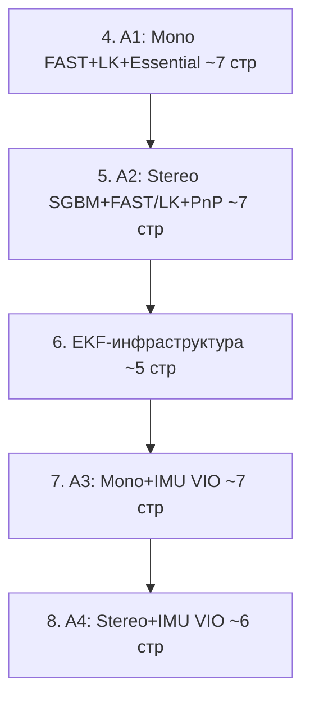

# План написания диплома — Итерация 3 (Часть 2: Главы 4-8)

## Что делаем в этой итерации

Два параллельных дела:

1. **Правки большого плана** `[.cursor/plans/diploma_structure_plan_e27090c8.plan.md](.cursor/plans/diploma_structure_plan_e27090c8.plan.md)`:
   - Глава 2: переписать 10 подразделов (2.1-2.10) на 4 секции по классам алгоритмов — basic / mono / stereo / VIO. Соответствует уже одобренной структуре из [iteration 2 plan](.cursor/plans/diploma_part1_detailed_842a9ffc.plan.md) §"Глава 2".
   - Глава 3: объединить 3.2-3.4 (Odometry + Raw + mapping) в один раздел "Структура KITTI: сенсоры, калибровка, две модальности"; добавить явный акцент на калибровке (P_i, $T_{\text{cam}\leftarrow\text{imu}}$) и системах координат как фундаменте для VIO в главах 7-8. Подробный маппинг Odo↔Raw остаётся в практической Главе 11 (или в Главе 9 — обсудим).
   - A5 (ORB-SLAM3 wrapper) — больше не собственная имплементация: в Главе 11 сравнение ведётся с опубликованными числами Campos 2021. Удалить TODO `stage9_orbslam3`, пересмотреть формулировку Ch 11 §11.7. Уже отражено в [iteration 2 plan §сокращённая структура](.cursor/plans/diploma_part1_detailed_842a9ffc.plan.md), теперь нужно зафиксировать в большом плане.

2. **Создать новый файл** `.cursor/plans/diploma_part2_detailed_*.plan.md` с детальным планом Глав 4-8 — содержание ниже.

## Целевые объёмы Части 2: ~32-35 страниц

| Глава | Целевой объём | Ключевых формул | Изображений |
| ----- | ------------- | ---------------:| -----------:|
| 4. A1 — Mono FAST+LK+Essential | ~7 стр | 4 | 2 |
| 5. A2 — Stereo SGBM+FAST/LK+PnP | ~7 стр | 2 (+ ссылки на 2.6, 2.7) | 2 |
| 6. EKF-инфраструктура | ~5 стр | 5 | 1 |
| 7. A3 — Mono+IMU loosely-coupled VIO | ~7 стр | 2 | 3 |
| 8. A4 — Stereo+IMU loosely-coupled VIO | ~6 стр | 1 | 3 |

Принцип отбора формул (как в Части 1): только то, без чего нельзя описать, **что именно** делает алгоритм; всё, что относится к выводу (Nister 5-point, SVD-декомпозиция $E$, формула Родрига, разбивка $F$ на блоки) — упоминается одной фразой со ссылкой на источник. По решению второй итерации диалога — EKF-глава **сжата до фундаментальных формул** (predict + update + manifold) без выписывания блоков $F, G_c$; алгоритмические главы — без излишней педагогической прозы.



---

## ГЛАВА 4. Алгоритм A1: монокулярная VO на FAST + LK + Essential Matrix (~7 стр)

Исходники: [stages/04_a1_implementation.md](stages/04_a1_implementation.md), [src/algorithms/mono_fast_lk.py](src/algorithms/mono_fast_lk.py).

### 4.1. Постановка задачи моно-VO (~0.3 стр)

Вход — кадры $\{I_k\}$ от одной камеры; выход — абсолютные позы $\{T_k \in SE(3)\}$ в системе кадра 0. Фундаментальная scale ambiguity (формула 2.5 из Главы 2) — модуль перемещения принципиально не наблюдаем без внешнего источника: для A1 на KITTI это GT, для A3 это IMU (Глава 7).

### 4.2. Детектирование и трекинг фич: FAST + Pyramidal LK (~1.5 стр, 1 формула)

- **FAST-детектор** (Rosten 2006): сравнение центральной точки с 16 пикселями на круге радиуса 3 → если ≥ 9 последовательных точек ярче или темнее на порог $t$ → угол. Параметры в реализации: `threshold=25`, `nonmax_suppression=True`.
- **Pyramidal LK** (Lucas-Kanade 1981; Bouguet 2001): отслеживание точек между кадрами по brightness constancy.

**Формула 4.1 (уравнение оптического потока):**

```latex
I_x u + I_y v + I_t = 0
```

где $I_x, I_y$ — пространственные градиенты, $I_t$ — временная производная, $(u, v)$ — пиксельное смещение. *Источник: Bouguet 2001 eq. 1.* Пирамида (`maxLevel=3`, `winSize=(21,21)`) обходит ограничение small motion; status mask отсекает точки, где LK не сошёлся.
- **Re-detection**: при $n_{\text{features}} < 2000$ на следующем шаге запускается FAST.detect(prev_gray) заново.
- **Изображение 4.1:** Пирамида LK — три уровня масштабирования, итеративный refinement смещения от грубого к точному; иконка FAST-угла рядом (опционально).

### 4.3. Essential matrix и SE(3)-инверсия для KITTI-семантики (~1.5 стр, 1 формула)

- Связь между двумя кадрами через Essential matrix $E$ (формула 2.4 из Главы 2). 5-точечный алгоритм Нистера (Nister 2004) даёт минимальное решение; RANSAC-обёртка `cv2.findEssentialMat(pts0, pts1, focal, pp, RANSAC, 0.999, 1.0)`.
- Декомпозиция $E = U\Sigma V^T$ → 4 кандидата $(R_i, t_i)$; chirality check выбирает тот, где триангулированные точки в положительной полуплоскости перед обеими камерами (Hartley-Zisserman §9.6). `cv2.recoverPose` делает обе шаги автоматически.
- Семантика результата `(R_cv, t_cv)`: $T_{\text{curr}\leftarrow\text{prev}}$, $\|t_{cv}\|=1$.

**Формула 4.2 (SE(3)-инверсия для KITTI-композиции):**

```latex
R_{\text{rel}} = R_{cv}^T, \qquad t_{\text{rel}} = -R_{cv}^T \cdot t_{cv}
```

Даёт $T_{\text{prev}\leftarrow\text{curr}}$ для $T_k = T_{k-1} \cdot T_{\text{rel}}$ (формула 2.3). *Реализовано в [src/algorithms/mono_fast_lk.py](src/algorithms/mono_fast_lk.py).* Без этой инверсии `final_drift` на seq 04 был 271 м вместо 5 м (прямая корректировка относительно old_structure).

### 4.4. Накопление позы и восстановление масштаба из GT (~0.7 стр, 1 формула)

- KITTI-композиция через `Pose.compose()`: `self._abs = self._abs.compose(rel_pose)`.

**Формула 4.3 (KITTI-scale из GT):**

```latex
s_k = \| t_k^{\text{gt}} - t_{k-1}^{\text{gt}} \|
```

*Стандартная практика mono-VO на KITTI (Avi Singh tutorial).* Без этого scale unobservable; в A3 эту функцию выполняет IMU.

### 4.5. Эвристический gate forward-axis dominance (~0.7 стр, 1 формула)

**Формула 4.4 (forward-axis + min-scale gate):**

```latex
\bigl(|t_{cv,z}| > \max(|t_{cv,x}|, |t_{cv,y}|)\bigr) \wedge \bigl(s_k > 0.1\ \text{м}\bigr)
```

Если условие не выполнено — VO-update пропускается. При остановках/боковом движении `cv2.recoverPose` возвращает шум в направлении; такие measurement-ы дрейфят траекторию. Для KITTI справедливо (автомобиль едет вперёд); в Главе 7 этот гейт пришлось вернуть в A3 для тех же причин (без него A3 разваливался). Для произвольного движения нужен $\chi^2$-test innovation.

### 4.6. Итоговая блок-схема (~0.5 стр)

**Изображение 4.2:** Блок-схема A1 — flowchart: prev_gray → (if $n_{\text{features}} < 2000$) FAST.detect → LK от prev к curr → filter status==1 → (if < 10 точек) return None → findEssentialMat → recoverPose → SE(3)-инверсия (4.2) → forward-axis + scale gates (4.4) → Pose.compose → return absolute Pose.

### 4.7. Известные ограничения (~0.3 стр)

Накопительный drift (mono-VO принципиально дрейфует без BA / loop closure); scale unobservable без внешнего источника; failure modes — forward motion (E вырождается на seq 01), малые повороты на стоянке (recoverPose даёт шум), очень быстрое движение (LK теряет точки). Сводная таблица результатов A1 на KITTI Odo seq 01/04/05/08 — в Главе 11.

---

## ГЛАВА 5. Алгоритм A2: стерео-VO на SGBM + FAST/LK + PnP (~7 стр)

Исходники: [stages/05_a2_implementation.md](stages/05_a2_implementation.md), [src/algorithms/stereo_sgbm_pnp.py](src/algorithms/stereo_sgbm_pnp.py), [src/algorithms/base.py](src/algorithms/base.py).

### 5.1. Постановка задачи стерео-VO (~0.3 стр)

Вход — стерео-пара $(I_L^k, I_R^k)$ rectified; выход — абсолютные позы $\{T_k\}$ в metric scale (без GT-cheat). Преимущество стерео: scale измерим через baseline (формула 2.6 из Главы 2).

### 5.2. Semi-Global Block Matching и параметры (~2 стр, 1 формула, 1 таблица)

- Block Matching: для каждого $(u_L, v)$ ищется $(u_R, v)$ с минимальной SAD в блоке `blockSize × blockSize`; $d = u_L - u_R$. Локально → шум на низко-текстурных областях.
- SGBM (Hirschmüller 2008) — DP-агрегация cost вдоль 8 направлений со штрафами за скачки disparity.

**Формула 5.1 (целевая функция SGBM):**

```latex
E(D) = \sum_p \biggl[ C(p, D_p) + \sum_{q \in N_p} P_1 \cdot \mathbb{1}[|D_p - D_q| = 1] + \sum_{q \in N_p} P_2 \cdot \mathbb{1}[|D_p - D_q| > 1] \biggr]
```

где $C(p, D_p)$ — matching cost (SAD), $P_1 < P_2$ — штрафы за малый/большой скачок. Минимизация через DP. *Источник: Hirschmüller 2008, eq. 2-3.*

- Параметры в реализации: `minDisparity=0`, `numDisparities=128`, `blockSize=5`, `P1=8·5²=200`, `P2=32·5²=800` (канон для grayscale), `disp12MaxDiff=1`, `uniquenessRatio=10`, `speckleWindowSize=100`, `speckleRange=2`, `mode=SGBM_3WAY` (3.6× быстрее MODE_HH при паритете).
- **Таблица 5.1 (sweep SGBM на seq 04, 271 кадр):** из stages/05 — defaults vs (numDisp ±32, blockSize 3/7, uniq 5/15, mode_HH); столбцы: config / ATE rmse / drift / ms/fr / success. Defaults — robust pick (0.245 м); mode_HH 3.6× медленнее при паритете.
- **Изображение 5.1:** Пример disparity map от SGBM на KITTI seq 04 — слева rectified кадр, справа disparity heatmap (близкие светлые, дальние тёмные); подсвечены зоны валидной/невалидной disparity.

### 5.3. Депроекция в 3D и LK-tracking 2D-фич (~0.7 стр)

- Депроекция (формула 2.6 из Главы 2). Фильтрация по валидной disparity: $d \in [1, +\infty)$ (точки с $d < 1$ — numerical inf depth); border 1 px отбрасывается (SGBM ненадёжен у краёв). *Реализовано в [src/algorithms/base.py](src/algorithms/base.py): `select_features_with_valid_disparity`, `pixels_to_3d`.*
- LK-tracking тот же, что в A1 (переиспользование `LKTracker`). При `status==1` синхронно отбираем $\mathbf{P}_i^{cam_{k-1}}$ (3D из прошлого кадра) и $\mathbf{u}_i^{cam_k}$ (2D с текущего).

### 5.4. PnP RANSAC и SE(3)-инверсия (~1 стр, 1 формула)

- Задача PnP — формула 2.7 из Главы 2 (минимизация перепроекции).
- `cv2.solvePnPRansac(prev_pts_3d, curr_pts_2d, K)` с параметрами: `iterationsCount=200`, `reprojectionError=2.0 px`, `confidence=0.99`, `flags=SOLVEPNP_ITERATIVE`.
- Семантика результата: $\mathbf{P}_{\text{curr}} = R_{cv} \mathbf{P}_{\text{prev}} + t_{cv}$ (трансформ cam_prev → cam_curr).

**Формула 5.2 (SE(3)-инверсия PnP-результата, та же логика что в A1):**

```latex
R_{\text{rel}} = R_{cv}^T, \qquad t_{\text{rel}} = -R_{cv}^T \cdot t_{cv}
```

*Реализовано в [src/algorithms/stereo_sgbm_pnp.py](src/algorithms/stereo_sgbm_pnp.py).* В отличие от A1, $t_{\text{rel}}$ уже metric (через baseline в `pixels_to_3d`).

### 5.5. Inliers ratio gate и переинициализация состояния (~0.5 стр)

- В A2 **нет** forward-axis gate из A1: у стерео физический metric → движение в любую сторону измеримо; гейт отрезал бы валидные update'ы на поворотах seq 05/08.
- Единственный фильтр: $n_{\text{inliers}} \geq \max(8,\ 0.3 \cdot N_{\text{tracked}})$. Если не пройден → `ok=False`, runner повторяет последнюю позу + инкремент failed_frames.
- После каждого успешного шага `_build_features(left_curr, right_curr)` строит свежий набор фич (в отличие от A1, где LK-точки переиспользуются). Причина: стерео-PnP даёт точную 3D-геометрию из текущей disparity, копить старые 3D-точки бессмысленно.

### 5.6. Итоговая блок-схема (~0.5 стр)

**Изображение 5.2:** Блок-схема A2 — flowchart: на первом кадре `_build_features` (SGBM → FAST → filter disp → pixels_to_3d) → return None. На следующих: LK от prev_left к curr_left → синхронный mask → (if ≥ 8 точек) solvePnPRansac → (if inliers ratio < 0.3) return None → SE(3)-инверсия (5.2) → Pose.compose → переинициализация фич → return absolute Pose.

### 5.7. Известные ограничения и highway-сценарий (~1.5 стр, 1 таблица)

A2 на seq 01 ATE = 252 м, в 3.65× **хуже** A1 с GT-scale. Это не баг, а известная слабость baseline стерео без BA:

- **Быстрое движение** 70-100 км/ч → ego-motion 2-3 м между кадрами @ 10 Hz → LK с winSize=21 px начинает терять точки (15/1101 failed).
- **Доминирующие дальние объекты** (небо, дальние деревья) с disp 1-3 px → шум depth $\sim 25\%$ при Z $\sim$ 190 м → PnP смещает оценку поступательного движения.
- **Бедная road-texture**: FAST детектит мало стабильных фич на однотонном асфальте.

**Таблица 5.2 (sweep min_disparity на seq 01):** из stages/05 — min_disp 1.0/2.0/3.0/5.0 → ATE / drift / failed_frames. Ужесточение делает только хуже (меньше валидных фич → больше failed-кадров). Решение seq 01 — не в фильтрации disparity, а в смене tracking-механизма (ORB matching, A6) или добавлении IMU (A4) / BA (вне scope).

---

## ГЛАВА 6. Инфраструктура расширенного фильтра Калмана для VIO (~5 стр, 5 ключевых формул)

Исходники: [stages/06_ekf_implementation.md](stages/06_ekf_implementation.md), [src/fusion/imu_model.py](src/fusion/imu_model.py), [src/fusion/ekf.py](src/fusion/ekf.py).

По решению второй итерации обсуждения — глава сжата до фундаментальных компонентов loosely-coupled quaternion EKF. Блоки $F, G_c$ выписаны как ссылка на исходники, без полных формул. Tightly-coupled и ESKF-подходы упомянуты в Заключении.

### 6.1. Постановка задачи fusion и выбор loosely-coupled (~0.5 стр)

Цель: получить точную позу, используя VO (с шумом и accumulative drift) и IMU (с шумом и квадратичным дрейфом без коррекции). Выбран loosely-coupled подход: VO выдаёт 6-DoF позу как «измерение», EKF фильтрует. Преимущества — модульность (любой VO можно подменить) и простота; недостатки — больший дрейф, чем у tightly-coupled (VINS-Mono, ORB-SLAM3 inertial), где feature и IMU residuals оптимизируются совместно через preintegration. Обоснование: соответствие большому плану, проще защищать.

### 6.2. Состояние EKF и параметризация ошибки на manifold (~0.5 стр, 1 формула)

**Формула 6.1 (nominal state и error state):**

```latex
\mathbf{x} = (\mathbf{p},\, q,\, \mathbf{v},\, \mathbf{b}_a,\, \mathbf{b}_g) \in \mathbb{R}^3 \times \mathbb{H}_1 \times \mathbb{R}^9,
\quad
\delta\mathbf{x} = (\delta\mathbf{p},\, \delta\boldsymbol{\theta},\, \delta\mathbf{v},\, \delta\mathbf{b}_a,\, \delta\mathbf{b}_g) \in \mathbb{R}^{15}
```

где $q \in \mathbb{H}_1$ — единичный кватернион (4 числа, 3 DOF), $\delta\boldsymbol{\theta}$ — малый поворот в касательном пространстве world frame ($q_{\text{true}} = \exp_q(\delta\boldsymbol{\theta}) \otimes q$). *Источник: Sola 2017 §3.2.* Реализовано в [src/fusion/imu_model.py](src/fusion/imu_model.py) (`ImuState`, размер 16) и [src/fusion/ekf.py](src/fusion/ekf.py) (`EKF.P` 15×15).

### 6.3. IMU-модель и predict step (~1.2 стр, 2 формулы)

**Формула 6.2 (модель измерений IMU):**

```latex
\mathbf{a}_{\text{meas}} = R(q)^T (\mathbf{a}_{\text{true}} - \mathbf{g}) + \mathbf{b}_a + \mathbf{n}_a,
\qquad
\boldsymbol{\omega}_{\text{meas}} = \boldsymbol{\omega}_{\text{true}} + \mathbf{b}_g + \mathbf{n}_g
```

$\mathbf{a}_{\text{meas}}$ — specific force (для KITTI OXTS: поля `af, al, au`); $\mathbf{n}_a, \mathbf{n}_g$ — белый шум с PSD $\sigma_a^2, \sigma_g^2$. *Источник: Sola 2017 §4.4.*

**Формула 6.3 (дискретный propagate, Euler):**

```latex
\mathbf{a}_w = R(q)(\mathbf{a}_{\text{meas}} - \mathbf{b}_a) + \mathbf{g},\
\mathbf{p}_{k+1} = \mathbf{p}_k + \mathbf{v}_k \Delta t + \tfrac{1}{2} \mathbf{a}_w \Delta t^2,\
\mathbf{v}_{k+1} = \mathbf{v}_k + \mathbf{a}_w \Delta t,\
q_{k+1} = q_k \otimes \exp_q(\boldsymbol{\omega} \Delta t)
```

*Реализовано в [src/fusion/imu_model.py](src/fusion/imu_model.py) (`propagate`).* Bias — random walk через process noise.

Ковариация пропагируется как $P_{k+1} = F P_k F^T + G_c Q_c G_c^T \Delta t$, где $F \in \mathbb{R}^{15\times 15}$ — discrete-time переход error-state ($\delta\mathbf{p} \leftarrow \delta\mathbf{p} + \delta\mathbf{v}\Delta t$, $\delta\boldsymbol{\theta} \leftarrow \delta\boldsymbol{\theta} - R\delta\mathbf{b}_g\Delta t$ и т.д.), $G_c \in \mathbb{R}^{15\times 12}$ — noise input matrix, $Q_c$ — PSD. Полные блоки — Sola 2017 §6 eq. 270; Weiss MSF 2013 eq. 4.62. Реализация — [src/fusion/imu_model.py](src/fusion/imu_model.py) (`state_transition_jacobian`); после симметризация $P \leftarrow (P+P^T)/2$. Замечание: для KITTI Raw `*_sync/` имеем 1 IMU-семпл на кадр (~10 Hz); для loosely-coupled это OK (см. §6.5).

### 6.4. Update step от позы и ⊞-update на manifold (~1.5 стр, 2 формулы)

**Формула 6.4 (innovation и Kalman gain):**

```latex
\mathbf{y} = \begin{pmatrix} \mathbf{t}_{\text{meas}} - \mathbf{p} \\ \log(R_{\text{meas}} R^T) \end{pmatrix} \in \mathbb{R}^6,
\qquad
K = P H^T (H P H^T + R_{\text{meas}})^{-1},
\qquad
\delta\mathbf{x} = K \mathbf{y}
```

$\log: SO(3) \to \mathfrak{so}(3) \cong \mathbb{R}^3$ — inverse Rodrigues; $\log(R_{\text{meas}} R^T)$ — малый поворот $\delta\boldsymbol{\theta}_{\text{world}}$. $H \in \mathbb{R}^{6\times 15}$ выделяет наблюдаемые блоки $\delta\mathbf{p}$ и $\delta\boldsymbol{\theta}$.

**Формула 6.5 (⊞-update на manifold):**

```latex
q_{\text{new}} = \exp_q(\delta\boldsymbol{\theta}) \otimes q_{\text{old}},
\qquad
\mathbf{p}_{\text{new}} = \mathbf{p} + \delta\mathbf{p},\quad
\mathbf{v}_{\text{new}} = \mathbf{v} + \delta\mathbf{v},\quad
\mathbf{b}^{\text{new}} = \mathbf{b} + \delta\mathbf{b}
```

Для $q$ нельзя $q + \delta q$ — уйдёт с многообразия единичной нормы. *Источник: Sola 2017 §6.* Ковариация обновляется через Joseph form $P^+ = (I-KH) P (I-KH)^T + K R_{\text{meas}} K^T$ (Bar-Shalom §5) — численно стабильнее стандартной, гарантирует $P \succeq 0$. После — симметризация и ре-нормализация $q \leftarrow q/\|q\|$. *Реализовано в [src/fusion/ekf.py](src/fusion/ekf.py) (`EKF.update_pose`).*

**Гравитация в cam-frame:** по умолчанию EKF использует ENU-конвенцию $\mathbf{g} = (0,0,-9.81)$, но для A3/A4 (Главы 7-8) world frame = cam0[0] (y вниз) → $\mathbf{g} = (0,+9.81,0)$. Параметр `gravity=` в `EKF.__init__` позволяет адаптеру задать направление без правок самого EKF. Эмпирически: без этой правки A3 на drive_0016 расходился до ATE ~270 м за 30 с; с правкой ATE = 6.9 м (×40 улучшение).

### 6.5. Итоговая блок-схема и валидация (~1.3 стр, 2 таблицы, 1 изображение)

**Изображение 6.1:** Блок-схема EKF — цикл: IMU-семпл → predict (формула 6.3 + propagate ковариации) → если есть VO-измерение → update (формулы 6.4, 6.5) → выход $\mathbf{x}$.

- **Synthetic test** (круговое движение R=10 м, ω=0.5 рад/с, 30 с, истинные bias заданы). Из stages/06: при 100 Hz IMU + 10 Hz VO — pos RMSE 0.04 м, ori RMSE 0.005 рад; при 10 Hz / 10 Hz (KITTI sync) — 0.08 м / 0.006 рад. Все варианты удовлетворяют целям < 0.3 м / < 0.05 рад; bias оценивается с погрешностью 10-40%.
- **Predict-only smoke-test** на 7 KITTI Raw drives. **Таблица 6.1**: drift через 5 с / max / final. Уже за 5 с — десятки метров; за 30 с — сотни; за 5 минут — 16-17 км. Квадратичный дрейф двойного интегрирования некомпенсированных шумов IMU — это и есть содержательное обоснование, **зачем** в A3/A4 нужен `EKF.update_pose`.

---

## ГЛАВА 7. Алгоритм A3: Mono+IMU loosely-coupled VIO (~7 стр)

Исходники: [stages/07_a3_implementation.md](stages/07_a3_implementation.md), [src/algorithms/mono_imu_ekf.py](src/algorithms/mono_imu_ekf.py).

### 7.1. Постановка задачи и архитектурное решение (~0.5 стр)

Вход — моно-кадры + IMU-burst + (опц) GT для инициализации; выход — абсолютные позы $\{T_k\}$ в metric scale без cheat на каждом кадре. Loosely-coupled подход: A1 (через `MonoFastLkCore`) как pose sensor, EKF из Главы 6 как fusion, scale per-step из IMU prediction вместо GT. Главная цель — показать, что компоненты Глав 4 и 6 склеиваются в одну работающую систему **без изменения их внутренней реализации**.

### 7.2. Жизненный цикл и GT-инициализация (~1.2 стр, 1 изображение)

- `reset(calibration)`: init `MonoFastLkCore`, `EKF(gravity=(0,+9.81,0))`, сохранить $T_{\text{imu}\leftarrow\text{cam}}$ и $T_{\text{cam}\leftarrow\text{imu}}$.
- `process(frame_0)`: $T_{w,\text{imu},0} = T_{w,\text{cam},0} \cdot T_{\text{cam}\leftarrow\text{imu}}$, $\mathbf{v}=0$, $\mathbf{b}_a=\mathbf{b}_g=0$.
- `process(frame_1)`: уточнить $\mathbf{v}_0 = (\mathbf{t}_1^{\text{gt}} - \mathbf{t}_0^{\text{gt}}) / \Delta t$ ДО первого predict (one-shot доступ к GT для velocity).
- `process(frame_i, i \geq 2)`: predict от IMU → MonoFastLkCore.step → forward-axis gate → SE(3)-инверсия → scale из IMU → min-scale gate → compose → EKF.update_pose.

Выбран вариант init **(A)** (GT для p0/q0 + v0 из gt[1]-gt[0]) из трёх рассмотренных в stages/07: (B) identity start + scale-init из первых N кадров — отклонён (транзиент ~30 кадров); (C) GT для всех кадров (как A1) + EKF поверх — отклонён (вырождает A3 в «A1 + smoothing», VIO-эффект не виден). После frame 1 A3 **не обращается** к gt — полноценный VO-алгоритм.

**Изображение 7.1:** Mermaid-диаграмма жизненного цикла A3 (frame 0 / frame 1 / frame i с условиями ok / forward-axis / min-scale). Брать напрямую из stages/07.

### 7.3. Scale per-step из IMU prediction (~1.2 стр, 1 формула)

В loosely-coupled mono-VIO scale unobservable из одной камеры. Стандартный подход — модуль ожидаемого смещения камеры из IMU integration.

**Формула 7.1 (scale per-step):**

```latex
\hat{\mathbf{p}}_{w,\text{cam,predict},k} = \text{EKF.get\_pose}(T_{\text{imu}\leftarrow\text{cam}}).\mathbf{t}\ \text{(после predict, до update)}
```

```latex
s_k = \bigl\| \hat{\mathbf{p}}_{w,\text{cam,predict},k} - \mathbf{p}_{w,\text{cam,meas},k-1} \bigr\|,
\qquad
T_{\text{rel}} = \bigl(R_{\text{rel}},\ s_k \cdot \hat{\mathbf{t}}_{\text{rel}}\bigr)
```

$\hat{\mathbf{t}}_{\text{rel}}$ — unit-norm из MonoFastLkCore (формула 4.2). Норма $\delta_{\text{world}}$ инвариантна под rotation: $\|p_{w,\text{curr}} - p_{w,\text{prev}}\| = \|t_{\text{rel}}\|$. Альтернатива $s_k = \|\mathbf{v}\|\Delta t$ даёт идентичный результат (Δ ATE < 5%, stages/07). *Реализовано в [src/algorithms/mono_imu_ekf.py](src/algorithms/mono_imu_ekf.py).*

### 7.4. Gates и composition VO-позы (~0.7 стр, 1 формула)

- **Forward-axis gate** (формула 4.4): возвращён из A1. Без него на drive_0018 A3 разваливался с ATE 18 км. Корень: при остановках на светофорах `cv2.recoverPose` выдаёт случайные направления, EKF с фиксированным $R_{\text{meas}}$ пропускает их в update.
- **Min-scale gate**: при $s_k < 0.01$ м VO update пропускается (ZUPT-like).

**Формула 7.2 (composition и перевод в IMU frame):**

```latex
T_{w,\text{cam,meas}}^{(k)} = T_{w,\text{cam,meas}}^{(k-1)} \cdot T_{\text{rel}},
\qquad
T_{w,\text{imu,meas}}^{(k)} = T_{w,\text{cam,meas}}^{(k)} \cdot T_{\text{cam}\leftarrow\text{imu}}
```

Подаётся в `EKF.update_pose(T_w_imu_meas, R_meas)` в IMU body frame; после update сохраняется $T_{w,\text{cam,meas}}^{(k)}$ как база для следующего scale per-step.

### 7.5. Тюнинг R_meas и bias init (~1 стр, 1 таблица)

**Таблица 7.1 (sweep R_meas и bias init на drive_0018, 2762 кадра):** реальные числа из stages/07 — `sigma_p_meas × sigma_theta_meas × bias_init → mean ATE`.

Интерпретация (кратко): `sigma_p_meas=0.1` — sweet spot (ниже — outliers ломают позу, выше — VO слабо корректирует drift); `sigma_theta_meas=0.01` — оптимум (ниже неустойчиво, выше yaw drift); `bias init=1e-6` — узкая полоса (default 1e-2/1e-4 даёт EKF свободу «объяснить» measurement через bias → underestimate velocity).

Дефолты `MonoImuEKF.__init__`: `sigma_a=0.05`, `sigma_g=0.005`, `sigma_p_meas=0.1`, `sigma_theta_meas=0.01`, `initial_P_bias=1e-6`.

### 7.6. Итоговая блок-схема (~0.5 стр)

**Изображение 7.2:** Блок-схема A3 — flowchart: predict от IMU → MonoFastLkCore.step → (if ok=False) return predict-only pose → forward-axis gate → SE(3)-инверсия → scale per-step (7.1) → min-scale gate → compose (7.2) → EKF.update_pose → save $T_{w,\text{cam,meas}}$ → return EKF.get_pose.

### 7.7. Результаты A3 на 4 KITTI Raw drives и фундаментальные ограничения (~1.5 стр, 1 таблица)

**Таблица 7.2 (A3 vs A1 на 4 raw drives):** числа из stages/07 — drive / сцена / A1 ATE / A3 ATE / соотношение.

A3 systematically уступает A1 на коротких/средних драйвах (≥×10) и сравним с A1 только на drive_0042 (highway), где A1 теряет parallax. Причины (фундаментальные для loosely-coupled mono-VIO без global anchor):

- **Yaw unobservability через gravity**: pitch/roll корректируются gravity, но yaw — нет; gyro bias drift в yaw линеен с временем ($\sigma_g \cdot t \approx 1.4$ рад на 287 с drive_0018 без корректировки).
- **Scale observability требует возбуждения**: на KITTI почти постоянная скорость → scale unidentifiable вдоль direction постоянной acceleration (Mourikis et al. 2007).
- **Loosely-coupled vs tightly-coupled**: tightly-coupled (VINS-Mono, MSCKF) используют features в residuals напрямую — у нас этого нет.

A3 в работе — иллюстрация механики EKF-VIO и расширяемости архитектуры (готовый базис для A4); не претендует быть SOTA. Эту формулировку использовать в защите.

**Изображение 7.3:** Overlay A3 vs GT vs A1 на drive_0018 в X-Z (вид сверху) — наглядно демонстрирует scale drift и yaw drift A3 по сравнению с A1 с GT-scale. Скриншот из `ComparatorTab` GUI.

---

## ГЛАВА 8. Алгоритм A4: Stereo+IMU loosely-coupled VIO (~6 стр)

Исходники: [stages/08_a4_implementation.md](stages/08_a4_implementation.md), [src/algorithms/stereo_imu_ekf.py](src/algorithms/stereo_imu_ekf.py).

### 8.1. Постановка задачи Stereo+IMU (~0.3 стр)

Вход — стерео-кадры + IMU-burst + (опц) GT для инициализации; выход — абсолютные позы $\{T_k\}$ в metric scale. Loosely-coupled: A2 (через `StereoSGBMPnPCore`) как pose sensor с metric translation; тот же EKF, что в A3, но **без** scale per-step и **без** heuristic gates. Ключевая мотивация — показать, что добавление IMU к стерео-VO дополнительно улучшает точность (9.76 м → 6.70 м на drive_0018, ×30% улучшение).

### 8.2. Жизненный цикл (~0.7 стр, 1 изображение)

Тот же, что у A3 (apples-to-apples сравнение):

- `reset(calibration)`: init `StereoSGBMPnPCore` + `EKF(gravity=(0,+9.81,0))`, сохранить $T_{\text{imu}\leftarrow\text{cam}}$ и $T_{\text{cam}\leftarrow\text{imu}}$.
- `process(frame_0)`: `_init_ekf` из gt[0] + `core.step(left_0, right_0)` для прогрева prev_pts_3d (core возвращает ok=False, но строит prev-state).
- `process(frame_1)`: уточнить $\mathbf{v}_0$ из GT.
- `process(frame_i, i \geq 2)`: predict от IMU → `StereoSGBMPnPCore.step` → compose **без** gates → `EKF.update_pose`.

**Изображение 8.1:** Mermaid-диаграмма жизненного цикла A4 — наглядно проще A3 (нет блоков scale per-step и gates).

### 8.3. Composition без scale-recovery и отказ от gates (~0.7 стр, 1 формула)

Стерео-PnP уже даёт metric $t_{\text{rel}}$ через disparity и baseline (формула 5.2).

**Формула 8.1 (composition стерео):**

```latex
T_{w,\text{cam,meas}}^{(k)} = T_{w,\text{cam,meas}}^{(k-1)} \cdot T_{\text{rel}}^{\text{stereo}},
\qquad
T_{w,\text{imu,meas}}^{(k)} = T_{w,\text{cam,meas}}^{(k)} \cdot T_{\text{cam}\leftarrow\text{imu}}
```

$T_{\text{rel}}^{\text{stereo}}$ — уже metric. Никаких $s_k = \|\delta_{\text{world}}\|$ — стерео самодостаточно.

**Отказ от gates:** forward-axis gate (формула 4.4) **не нужен** — stereo-PnP не даёт шумных направлений на остановках, outliers отсекаются `min_inliers_ratio` в RANSAC (§5.5); min-scale gate тоже не нужен — при полной остановке PnP возвращает identity-translation. Если RANSAC даёт `ok=False`, A4 идёт в predict-only fallback без потери позы.

### 8.4. Тюнинг R_meas: стерео заслуживает более жёсткой ковариации (~1.3 стр, 2 таблицы)

**Таблица 8.1 (sweep sigma_p_meas на drive_0018, σ_θ=0.01):** из stages/08 — `sigma_p / ATE rmse / ATE max / drift / success / ms/frame`.

**Таблица 8.2 (sweep sigma_theta_meas, σ_p=0.02):** из stages/08.

Best overall: σ_p=0.02 м (**×5 меньше** A3 default 0.1 м), σ_θ=0.01 рад (тот же оптимум, что у A3).

Физическая интерпретация (кратко): стерео-PnP даёт metric translation с точностью disparity (sub-pixel × focal × baseline) → EKF доверяет ему значительно сильнее, чем mono+IMU-scale (которая зависит от качества IMU-предсказания с накапливающимся bias). Для ориентации — тот же оптимум, что у A3 (стерео не даёт принципиального улучшения).

Outlier check: $\text{ATE}_{\max}/\text{ATE}_{\text{rmse}} = 14.29/6.70 = 2.13 < 3.0$ → нет catastrophic outliers, adaptive $R_{\text{meas}}$ не нужен.

### 8.5. Архитектурное сравнение A3 vs A4 (~0.7 стр, 1 таблица)

**Таблица 8.3 (A3 vs A4):**

| Аспект | A3 (Mono+IMU) | A4 (Stereo+IMU) |
| --- | --- | --- |
| VO compose | unit $\hat{\mathbf{t}}_{\text{rel}}$, scale из IMU | metric $t_{\text{rel}}^{\text{stereo}}$ |
| Forward-axis / min-scale gates | да | нет |
| σ_p_meas default | 0.1 | 0.02 (×5 меньше) |
| Scale observability | low (требует возбуждения) | сильная (от baseline) |
| time/frame | ~17 мс | ~25 мс (SGBM) |

Вывод: A4 архитектурно **проще** A3 (нет scale per-step, нет gates) и при этом **точнее** на основном VIO benchmark drive_0018.

### 8.6. Итоговая блок-схема (~0.3 стр, 1 изображение)

**Изображение 8.2:** Блок-схема A4 — flowchart: predict от IMU → `StereoSGBMPnPCore.step` → (if ok=False) return predict-only → SE(3)-инверсия → compose (8.1) → перевод в IMU → `EKF.update_pose` → return EKF.get_pose. Заметно проще A3 (нет gates и scale-recovery).

### 8.7. Результаты A4 и известные ограничения (~1.8 стр, 1 таблица, 1 изображение)

**Таблица 8.4 (A1 vs A2 vs A3 vs A4 на 4 raw drives):** из stages/08 — drive / сцена / A1 / A2 (Raw) / A3 / A4.

**Главный научный результат — drive_0018 (основной VIO benchmark):**

- A4 ATE 6.70 м (best) vs A2 9.76 м (×30% улучшение от добавления IMU) vs A1 10.89 м (с GT-scale!) vs A3 570 м.
- A4 **даже лучше A1 с GT-scale** — IMU+стерео в loosely-coupled режиме реально лучше, чем mono-with-GT, потому что EKF фильтрует шумы стерео-PnP, оставаясь верным physical-scale. Это **самый сильный научный результат всей работы**.

Остальные сцены: drive_0020 (residential) — A4 ≈ A2, обе лучше A1; drive_0016 (short country, 28 с) — A4 ≈ A2 ≈ A1 (bias не сходится); drive_0042 (residential/highway) — A4 ≈ A2 ≈ 250 м, обе хуже A1 (известная слабость A2 на highway, §5.7).

**Изображение 8.3:** Overlay A1 vs A2 vs A3 vs A4 vs GT на drive_0018 в X-Z — наглядная демонстрация превосходства A4. Скриншот из `ComparatorTab`.

Известные ограничения: на highway loosely-coupled EKF не пересоздаёт features (решение — ORB matching или tightly-coupled BA, вне scope); на коротких драйвах <30 с bias не сходится (см. synthetic test §6.5); success_rate = 100% на всех 4 драйвах; time/frame ~25 мс — на 40% медленнее A3 из-за SGBM, но sub-real-time @ 10 Hz с запасом.

---

## Резюме итерации 3

После одобрения этого плана я:

1. **Применяю правки к большому плану** `[.cursor/plans/diploma_structure_plan_e27090c8.plan.md](.cursor/plans/diploma_structure_plan_e27090c8.plan.md)`:
   - Переписываю Главу 2 на 4 секции по классам алгоритмов.
   - Переписываю Главу 3 — объединяю Odometry/Raw в один раздел, акцент на калибровке и метриках.
   - Корректирую упоминания A5: больше не собственная имплементация, только опубликованные числа Campos 2021 в Главе 11.

2. **Создаю файл** `.cursor/plans/diploma_part2_detailed_<hash>.plan.md` (по образцу [iteration 2 plan](.cursor/plans/diploma_part1_detailed_842a9ffc.plan.md)) с содержимым выше:
   - Главы 4-8 в виде подробных outline'ов с LaTeX-формулами, словесными описаниями изображений в формате `[Изображение N.M: описание]`, code references на конкретные модули, ссылками на конкретные секции stages-документов.

3. После этого можно начинать **писать конкретную главу**:
   - Глава 4 (A1) — самая короткая и простая, удобный старт.
   - Глава 6 (EKF) — самая теоретичная, удобно писать перед Главами 7-8.
   - Главы 7-8 — пишутся последними, поскольку опираются на Главу 6.
   - Главы 5 и 4 — независимы друг от друга, можно писать параллельно.

Объём итогового текста Части 2: **~32-35 страниц** (сжато с ~46-50 после второй итерации обсуждения: EKF-глава урезана сильнее — 12 подразделов → 7, 8 формул → 5, 10 стр → 5; алгоритмические главы умеренно — мерджи родственных подразделов, плюс на 1 изображение меньше для A1/A2/EKF). Все формулы в LaTeX, картинки описаны словами для удобной вставки в Word.

