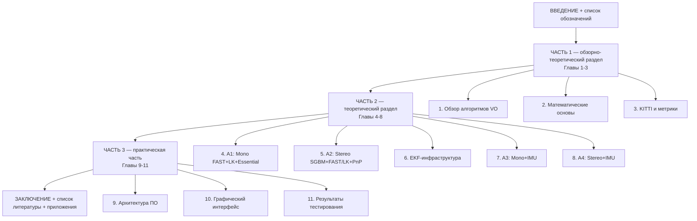

# План написания дипломной работы

## Тема и общая структура

**Тема:** «Программная система моделирования и исследования алгоритмов визуальной одометрии».

**Структура — 11 глав в 3 частях ТЗ** (аналог примеру друга, но с расширенной Частью 1 — обзорно-теоретической):

## ТЗ из 3 частей (формулировка задач, как у друга)

**Часть 1 — обзорно-теоретический раздел:**

- Провести обзор класса задач визуальной одометрии (VO) и существующих подходов; выполнить классификацию алгоритмов по сенсорной конфигурации (mono / stereo / VIO) и способу извлечения информации (feature-based / direct).
- Описать математические основы алгоритмов: модель камеры, преобразования группы SE(3), эпиполярную и стерео-геометрию, основы фильтра Калмана.
- Провести обзор бенчмарка KITTI (Odometry и Raw) и метрик оценки качества VO/SLAM (ATE, RPE).

**Часть 2 — теоретический раздел (методы и модели):**

- Разработать алгоритм A1 — монокулярная VO на основе FAST + LK + Essential matrix.
- Разработать алгоритм A2 — стерео-VO на основе SGBM + FAST/LK + PnP.
- Разработать инфраструктуру loosely-coupled расширенного фильтра Калмана для visual-inertial fusion (16-мерное состояние с кватернионом, IMU-модель, predict/update steps).
- Разработать алгоритм A3 — Mono+IMU loosely-coupled VIO с восстановлением scale из IMU-предсказания.
- Разработать алгоритм A4 — Stereo+IMU loosely-coupled VIO с metric-translation от стерео.

**Часть 3 — практическая часть:**

- Разработать архитектуру программной системы с едиными интерфейсами для алгоритмов и датасетов и реализовать модули (vo, algorithms, fusion, datasets, eval).
- Разработать графический пользовательский интерфейс (Tkinter + matplotlib): Chooser-вкладка с live-визуализацией прогона и Comparator-вкладка для сравнения траекторий.
- Реализовать программную систему и провести сравнительные эксперименты на KITTI Odometry/Raw с сопоставлением полученных результатов с эталонными значениями ORB-SLAM3.

## Развёрнутое содержание

**ВВЕДЕНИЕ** — актуальность, цели, задачи, объект и предмет исследования, структура работы.

**СПИСОК ОБОЗНАЧЕНИЙ И СОКРАЩЕНИЙ** — VO, VIO, SLAM, EKF, ATE, RPE, SE(3), SO(3), IMU, GT, FAST, LK, ORB, PnP, RANSAC, SGBM, KITTI, OXTS.

### Часть 1 — обзорно-теоретический раздел

**Глава 1. Обзор алгоритмов визуальной одометрии**

- 1.1. Понятие визуальной одометрии и её место в задачах навигации
- 1.2. Применение VO (autonomous vehicles, robotics, AR/VR, drones)
- 1.3. Классификация по сенсорной конфигурации (mono / stereo / RGB-D / VIO; SLAM vs VO)
- 1.4. Классификация по способу извлечения информации (feature-based / direct / hybrid)
- 1.5. Обзор существующих решений (LIBVISO2, ORB-SLAM3, VINS-Mono/Fusion, DSO, LSD-SLAM, SVO)
- 1.6. Постановка задачи исследования: набор A1-A4 для исследовательского стенда

**Глава 2. Математические основы алгоритмов VO**

- 2.1. Модель камеры pinhole и матрица intrinsics K
- 2.2. Группа SE(3) и представления позы
- 2.3. Кватернионы и кинематика вращения SO(3)
- 2.4. Накопление позы и композиция преобразований (KITTI-семантика)
- 2.5. Эпиполярная геометрия и Essential matrix (5-точечный алгоритм Нистера)
- 2.6. Стерео-геометрия: rectified pair, disparity → depth, triangulation
- 2.7. Решение PnP-задачи (3D ↔ 2D pose recovery, RANSAC)
- 2.8. Системы координат в KITTI: cam0, IMU body, world
- 2.9. Феномен scale ambiguity для mono VO и способы его разрешения
- 2.10. Основы фильтра Калмана как байесовского подхода (заделка под Главу 6)

**Глава 3. Датасет KITTI и метрики оценки качества VO**

- 3.1. Обоснование выбора KITTI как индустриального бенчмарка
- 3.2. KITTI Odometry Benchmark: структура, калибровка (P0..P3, Tr), ground truth (RTK-GPS + lidar SLAM)
- 3.3. KITTI Raw Data: структура, библиотека `pykitti`, OXTS-данные, GT из IMU/GPS
- 3.4. Маппинг Odometry ↔ Raw для apples-to-apples VIO-сравнений (см. таблицу из [stages/03_data_layout.md](stages/03_data_layout.md))
- 3.5. Метрика ATE с Umeyama-выравниванием
- 3.6. Метрика RPE на парах кадров
- 3.7. Вспомогательные метрики (drift, success rate, time/frame)

### Часть 2 — теоретический раздел (методы и модели)

**Глава 4. Алгоритм A1: монокулярная VO на FAST + LK + Essential Matrix**

- 4.1. Постановка задачи моно-VO и фундаментальная scale ambiguity
- 4.2. FAST-детектор фич (порог, non-maximum suppression)
- 4.3. Lucas-Kanade Optical Flow tracking (pyramidal LK, размер окна, status mask)
- 4.4. Восстановление E через `cv2.findEssentialMat`
- 4.5. Декомпозиция E → R, t через `cv2.recoverPose` и SE(3)-семантика результата
- 4.6. Накопление позы в KITTI-формате (с явной SE(3)-инверсией)
- 4.7. Восстановление масштаба из GT для KITTI
- 4.8. Эвристический gate forward-axis dominance
- 4.9. Re-detection при падении числа треков
- 4.10. Итоговая блок-схема алгоритма A1
- 4.11. Известные ограничения (drift, scale, малые повороты)

**Глава 5. Алгоритм A2: стерео-VO на SGBM + FAST/LK + PnP**

- 5.1. Постановка задачи стерео-VO и преимущества baseline
- 5.2. Block Matching и Semi-Global Block Matching (Hirschmüller)
- 5.3. Параметры SGBM: minDisparity, numDisparities, P1/P2, blockSize, uniquenessRatio (со значениями из реализации)
- 5.4. Фильтрация фич по валидной disparity и депроекция в 3D
- 5.5. Tracking фич между кадрами через LK и синхронный отбор 3D ↔ 2D соответствий
- 5.6. Решение PnP RANSAC (`cv2.solvePnPRansac`, итерации, reprojection error)
- 5.7. Inliers ratio gate как единственный фильтр и переинициализация состояния каждый кадр
- 5.8. Итоговая блок-схема алгоритма A2
- 5.9. Известные ограничения (highway-сцены, отсутствие стабильных фич)

**Глава 6. Инфраструктура расширенного фильтра Калмана для VIO**

- 6.1. Постановка задачи visual-inertial fusion
- 6.2. Loosely-coupled vs tightly-coupled подходы
- 6.3. Состояние EKF: 16-мерный вектор `[p, q, v, b_a, b_g]`, ковариация 15×15 в касательном пространстве
- 6.4. Дискретная IMU-модель: уравнения propagation в ENU/cam-frame
- 6.5. Якобиан перехода F (15×15) и шумовая входная матрица G_c (15×12)
- 6.6. Predict step: `P ← F·P·Fᵀ + G_c·Q_c·G_cᵀ·dt` + симметризация
- 6.7. Update step от позы: innovation, Kalman gain, ⊞-update для кватерниона
- 6.8. Joseph-form ковариации и ре-нормализация q
- 6.9. Гравитация и frame conventions (cam0[0] vs ENU)
- 6.10. Итоговая блок-схема EKF
- 6.11. Synthetic-валидация на круговом движении

**Глава 7. Алгоритм A3: монокулярная VIO с loosely-coupled EKF**

- 7.1. Постановка задачи Mono+IMU
- 7.2. Адаптер: `MonoFastLkCore` как pose sensor, EKF как fusion
- 7.3. Жизненный цикл: `reset` → `process` цикл (с диаграммой)
- 7.4. Инициализация: GT для p0/q0 на frame 0; v0 из (gt[1]−gt[0])/dt
- 7.5. Восстановление scale из IMU-предсказания (`||delta_world||`)
- 7.6. Composition абсолютной VO-позы и преобразование в IMU-frame
- 7.7. Forward-axis dominance gate (KITTI-specific) и его обоснование
- 7.8. Min-scale gate как ZUPT-like защита от шума на остановках
- 7.9. Тюнинг R_meas и initial P для bias (sweep-таблица)
- 7.10. Итоговая блок-схема алгоритма A3
- 7.11. Фундаментальные ограничения mono-VIO без global anchor (yaw unobservability, scale-наблюдаемость)

**Глава 8. Алгоритм A4: стерео-VIO с loosely-coupled EKF**

- 8.1. Постановка задачи Stereo+IMU
- 8.2. Адаптер: `StereoSGBMPnPCore` как pose sensor с metric translation
- 8.3. Жизненный цикл и инициализация (same_as_a3)
- 8.4. Composition без scale-recovery — стерео уже metric
- 8.5. Отказ от forward-axis и min-scale gate
- 8.6. Тюнинг R_meas: почему стерео-PnP заслуживает более жёсткой ковариации (sweep-таблица σ_p)
- 8.7. Сравнение архитектуры A3 vs A4 (таблица отличий)
- 8.8. Итоговая блок-схема алгоритма A4
- 8.9. Известные ограничения (highway, A4 ≈ A2)

### Часть 3 — практическая часть

**Глава 9. Архитектура программной системы**

- 9.1. Выбор программных технологий (Python 3.10+, OpenCV, NumPy, evo, pykitti, Tkinter, matplotlib, filterpy не использовали — почему)
- 9.2. Принцип взаимозаменяемых компонентов: алгоритмы и датасеты
- 9.3. Поток данных и взаимодействие модулей (диаграмма)
- 9.4. Структура каталогов `src/{vo, algorithms, fusion, datasets, eval, gui}`
- 9.5. Модуль интерфейсов `src/vo/`
  - 9.5.1. Структура `VOAlgorithm` (ABC)
  - 9.5.2. Структура `Pose`
  - 9.5.3. Структура `FrameData`
  - 9.5.4. Структура `Calibration`
  - 9.5.5. Структура `IMUSample`
  - 9.5.6. `is_compatible` helper и валидация capabilities
- 9.6. Модуль алгоритмов `src/algorithms/`
  - 9.6.1. Реестр `ALGORITHMS` и lazy import через декораторы
  - 9.6.2. Базовые хелперы (`FastDetector`, `LKTracker`, depth-utils)
  - 9.6.3. Структура реализаций A1-A4 (Core + Adapter паттерн)
- 9.7. Модуль fusion `src/fusion/`
  - 9.7.1. Структура `imu_model.py` (propagate, jacobian)
  - 9.7.2. Структура `ekf.py` (класс EKF)
- 9.8. Модуль датасетов `src/datasets/`
  - 9.8.1. ABC `Dataset` и реестр `DATASETS`
  - 9.8.2. Загрузчик `KittiOdometry`
  - 9.8.3. Загрузчик `KittiRaw` через `pykitti`
- 9.9. Модуль оценки `src/eval/`
  - 9.9.1. `metrics.py`: обёртки над `evo`
  - 9.9.2. `runner.py`: единый прогонщик с cancel/frame_callback
  - 9.9.3. `benchmark.py`: маппинг Odometry↔Raw, матрица прогонов
- 9.10. Воспроизводимость: фиксация RNG seed (`cv2.setRNGSeed`)

**Глава 10. Графический пользовательский интерфейс**

- 10.1. Архитектура GUI: `MainApp(tk.Tk)` + `ttk.Notebook` с двумя вкладками
- 10.2. Тред-модель: Tk-thread + Worker-thread + `threading.Event` для cancel
- 10.3. Вкладка `ChooserTab`
  - 10.3.1. Выбор алгоритма и датасета через cascading combobox-ы
  - 10.3.2. Фильтрация совместимых комбинаций через `is_compatible`
  - 10.3.3. Запуск прогона и cancel
  - 10.3.4. Прогресс и логирование через очередь
- 10.4. `LiveVisualizer` — live-визуализация прогона
  - 10.4.1. `FigureCanvasTkAgg` в Tkinter
  - 10.4.2. Throttling 20 fps и переиспользование артистов
  - 10.4.3. Опция отключения отрисовки кадра для скорости
- 10.5. Вкладка `ComparatorTab`
  - 10.5.1. `Treeview` со всеми сохранёнными прогонами, группировка по сцене
  - 10.5.2. Multi-overlay через `plot_overlay_multi`
  - 10.5.3. Umeyama-выравнивание и таблица метрик
- 10.6. Точки входа и legacy shortcuts (`python -m src.gui`)

**Глава 11. Результаты тестирования**

- 11.1. Методология сравнительных прогонов (фиксированный seed=42, evo с Umeyama)
- 11.2. Результаты A1 на KITTI Odometry (seq 01, 04, 05, 08) — таблица + графики
- 11.3. Результаты A2 на KITTI Odometry и KITTI Raw — таблицы + графики; разбор seq 01 как known limitation
- 11.4. Результаты A3 на 4 KITTI Raw drives — таблица + объяснение деградации
- 11.5. Результаты A4 на 4 KITTI Raw drives — таблица; drive_0018 как основной научный результат
- 11.6. Сводная сравнительная таблица A1 vs A2 vs A3 vs A4 на drive_0018 / Odo 05
- 11.7. Сопоставление с эталонными значениями ORB-SLAM3 (без своей имплементации; используются опубликованные числа)
- 11.8. Производительность: time/frame и real-time бюджет
- 11.9. Визуальное сравнение траекторий (multi-overlay скриншоты из ComparatorTab)
- 11.10. Выводы по экспериментам

**ЗАКЛЮЧЕНИЕ** — выводы по 3 частям ТЗ, оценка степени достижения целей, направления дальнейших исследований (tightly-coupled VIO, ORB-SLAM3 как полноценный пятый алгоритм, loop closure, EuRoC/TUM VI датасеты, Samsung S23 как реальный сенсор).

**СПИСОК ИСПОЛЬЗОВАННЫХ ИСТОЧНИКОВ** — на основе раздела 5 [.cursor/plans/vo_research_stand_bd4a3086.plan.md](.cursor/plans/vo_research_stand_bd4a3086.plan.md): KITTI papers (Geiger 2013), ORB-SLAM3 (Campos 2021), Sola «Quaternion kinematics», Bloesch ROVIO, Forster preintegration, Scaramuzza «VO Part I/II», Hartley & Zisserman MVG, Probabilistic Robotics (Thrun), Kalman & Bayesian Filters in Python (Labbe), evo (Grupp), pykitti, OpenCV docs.

**ПРИЛОЖЕНИЕ А** — листинги ключевых модулей (`src/vo/interface.py`, `src/fusion/ekf.py`, `src/fusion/imu_model.py`, ядра алгоритмов).
**ПРИЛОЖЕНИЕ Б** *(опционально)* — полные таблицы метрик из `results/metrics/`.

## Mapping существующих материалов на главы

Удобно тем, что для каждой главы Частей 2 и 3 уже есть подробный stage-документ — фактически 70-80% содержательного материала уже написано, нужно переписать в академическом стиле и добавить теоретическую обвязку.

- **Глава 1** — переработка раздела 1 [.cursor/plans/vo_research_stand_bd4a3086.plan.md](.cursor/plans/vo_research_stand_bd4a3086.plan.md) + расширение обзора по литературе (Scaramuzza, Geiger, Campos)
- **Глава 2** — выводы из [src/vo/interface.py](src/vo/interface.py), [src/algorithms/base.py](src/algorithms/base.py), Hartley & Zisserman, Sola
- **Глава 3** — почти целиком [stages/03_data_layout.md](stages/03_data_layout.md) + раздел 3 основного плана + Geiger 2013
- **Глава 4** — [stages/04_a1_implementation.md](stages/04_a1_implementation.md) + [src/algorithms/mono_fast_lk.py](src/algorithms/mono_fast_lk.py) + результаты прогонов на seq 01/04/05/08
- **Глава 5** — [stages/05_a2_implementation.md](stages/05_a2_implementation.md) + [src/algorithms/stereo_sgbm_pnp.py](src/algorithms/stereo_sgbm_pnp.py) + sweep-таблица SGBM
- **Глава 6** — [stages/06_ekf_implementation.md](stages/06_ekf_implementation.md) + [src/fusion/ekf.py](src/fusion/ekf.py) + [src/fusion/imu_model.py](src/fusion/imu_model.py) + Sola, Bloesch
- **Глава 7** — [stages/07_a3_implementation.md](stages/07_a3_implementation.md) + [src/algorithms/mono_imu_ekf.py](src/algorithms/mono_imu_ekf.py)
- **Глава 8** — [stages/08_a4_implementation.md](stages/08_a4_implementation.md) + [src/algorithms/stereo_imu_ekf.py](src/algorithms/stereo_imu_ekf.py)
- **Глава 9** — [stages/02_architecture.md](stages/02_architecture.md) + раздел 2 основного плана + актуальная структура `src/`
- **Глава 10** — [stages/09_gui_runner.md](stages/09_gui_runner.md) + [src/gui/](src/gui/)
- **Глава 11** — компиляция чисел из `results/metrics/*.json` + сводные таблицы из stage-документов 04-08; ORB-SLAM3 — опубликованные числа из [Campos et al., 2021](https://arxiv.org/abs/2007.11898)

## Общие рекомендации по стилю и объёму

- Объём — типичный для бакалаврского/магистерского диплома 80-110 страниц + приложения
- Каждая алгоритмическая глава (4, 5, 6, 7, 8) содержит итоговую блок-схему и подраздел «известные ограничения» — это академический стандарт и помогает на защите
- Все результаты — с указанием seed, числа кадров, success rate; сводные таблицы дублируют визуальные графики
- Для каждой главы Части 2 — ссылки на исходные статьи (Sola, Bloesch, Hirschmüller, Lucas-Kanade, Nister) в порядке появления
- Введение и заключение пишутся в самом конце, когда все 11 глав готовы
- Список обозначений и сокращений накапливается по мере написания глав

## Дальнейшие действия

После твоего утверждения этого плана я могу:

1. Сохранить этот план как отдельный markdown-файл в репозитории (например, `docs/diploma_outline.md`) — чтобы было удобно итеративно править структуру и фиксировать прогресс по главам.
2. Начать писать конкретную главу, если ты выберешь — я переключусь в Agent mode и буду опираться на соответствующий stage-документ + исходники.

