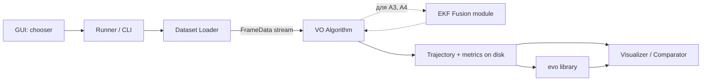

# Программная система моделирования и исследования алгоритмов визуальной одометрии

Дипломная работа, тема: исследование классов алгоритмов VO. Срок: 7 дней.

---

## 1. Цели работы и набор исследуемых алгоритмов

Тема диплома обязывает исследовать **классы алгоритмов**, варьируя сенсорную конфигурацию. Базовый набор — четыре собственные реализации + один внешний эталон.

### Основные алгоритмы (обязательные)

- **A1. Mono (FAST + LK + Essential Matrix)** — твой текущий, переносится в новый каркас как baseline.
- **A2. Stereo (StereoSGBM + 3D-2D PnP)** — собственная реализация. На каждом стерео-кадре считается disparity → 3D-координаты ORB-фич на левой камере → между кадрами match → `cv2.solvePnPRansac`. Решает scale ambiguity физикой baseline.
- **A3. Mono + IMU (loosely-coupled EKF)** — собственная реализация. 6-DoF Extended Kalman Filter: prediction step — пропагация состояния через IMU модель (100 Гц), update step — измерение от A1 (10 Гц). Состояние: `[p (3), q (4), v (3), b_a (3), b_g (3)]`. Библиотека `filterpy` для самого фильтра.
- **A4. Stereo + IMU (loosely-coupled EKF)** — тот же EKF, что в A3, но измерение от A2 (имеет абсолютный масштаб от стерео).
- **A5. ORB-SLAM3** — внешний эталон. Запускается во всех 4 режимах (mono / stereo / mono+IMU / stereo+IMU) через Docker. Результат сравнивается с A1-A4 на тех же данных. Не своя реализация — научный референс для оценки качества собственных алгоритмов.

### Дополнительный алгоритм (опционально, если останется время)

- **A6. Mono ORB + LK + Essential** — модификация A1, единственное отличие — feature extractor (FAST → ORB). Отвечает на вопрос «насколько чувствителен алгоритм к выбору детектора фич».

### Что НЕ делаем за 7 дней

- DSO / LSD-SLAM (direct methods)
- libviso2 / VINS-Fusion
- TartanVO / deep-learning подходы
- Собственный стереосетап на двух Samsung S23
- EuRoC / TUM VI датасеты
- **A2/A3/A4/A5 на Samsung S23** — у телефона одна mono-камера и неоткалиброванный IMU; стерео/VIO/референс ORB-SLAM3 на нём не имеют смысла без дополнительной железной работы.

Эти пункты честно упоминаются в работе как «возможные направления развития».

### Samsung S23 — только A1 как опциональный bonus

На собственных видео с Samsung S23 проверяется **только A1** (mono FAST+LK+Essential), и только как демо «работает на камере, отличной от KITTI». Это уже сделано в `[old_structure/run_vo_s23.py](old_structure/run_vo_s23.py)` со старой архитектурой и YAML-конфигом камеры. В новой архитектуре `[src/datasets/samsung_s23.py](src/datasets/samsung_s23.py)` оставлен как пустой каркас; его реализация не входит в Этапы 1-10. A2/A3/A4/A5 на S23 не запускаются.

---

## 2. Архитектура системы

Главный принцип: **алгоритмы и датасеты — взаимозаменяемые компоненты с едиными интерфейсами**. GUI, прогонщик и метрики не знают, что внутри.

### 2.1. Поток данных




### 2.2. Структура каталогов

```
srw_bmstu/
├── src/
│   ├── vo/
│   │   ├── interface.py            # VOAlgorithm ABC, FrameData, Pose
│   │   ├── visual_odometry.py      # существующий, остаётся
│   │   └── visualizer.py           # существующий, расширяется
│   ├── algorithms/                 # каждый алгоритм — отдельный файл
│   │   ├── base.py                 # общие хелперы (feature detection, matching)
│   │   ├── mono_fast_lk.py         # A1 (адаптер над visual_odometry.py)
│   │   ├── stereo_sgbm_pnp.py      # A2
│   │   ├── mono_imu_ekf.py         # A3 (использует fusion/ekf.py)
│   │   ├── stereo_imu_ekf.py       # A4 (использует fusion/ekf.py)
│   │   ├── orbslam3_wrapper.py     # A5 (вызов Docker, парсинг output)
│   │   └── mono_orb_lk.py          # A6 (опционально)
│   ├── fusion/                     # общая EKF-инфраструктура для A3 и A4
│   │   ├── ekf.py                  # 6-DoF EKF state, predict, update
│   │   └── imu_model.py            # модель пропагации через IMU + bias
│   ├── datasets/
│   │   ├── base.py                 # Dataset ABC
│   │   ├── kitti_odometry.py       # для A1, A2 без IMU
│   │   ├── kitti_raw.py            # для A3, A4 с IMU (через pykitti)
│   │   └── samsung_s23.py          # опционально: тонкий загрузчик для A1 demo (не реализуется в Этапах 1-10, см. ниже)
│   ├── eval/
│   │   ├── metrics.py              # обёртка над evo (ATE, RPE, drift)
│   │   ├── runner.py               # один прогон: algorithm × dataset → результат
│   │   └── benchmark.py            # массовый прогон: все × все
│   ├── gui/
│   │   ├── chooser.py              # Tkinter: выбор алгоритма + датасета + параметров
│   │   └── comparator.py           # окно сравнения N траекторий + GT
│   └── calibration/                # существующее, не трогаем
├── results/                        # сюда складываются траектории и метрики
│   ├── trajectories/               # *.txt в KITTI-формате
│   └── metrics/                    # *.json + графики
├── kitti_data/                     # см. раздел 3
└── docker/
    └── orbslam3/                   # Dockerfile и configs для A5
```

### 2.3. Ключевые интерфейсы (концептуально, без кода)

- `**VOAlgorithm**` — каждый алгоритм реализует:
  - `reset(calibration)` — инициализация с параметрами камер/IMU;
  - `process(frame_data) -> Pose | None` — один кадр в, накопленная поза наружу;
  - флаги `requires_stereo`, `requires_imu`, чтобы runner валидировал совместимость с датасетом.
- `**Dataset**` — каждый загрузчик реализует:
  - `calibration()` — словарь с intrinsics обеих камер, baseline, T_imu_cam;
  - `frames()` — итератор по `FrameData(timestamp, left, right, imu_burst, gt_pose)`;
  - `ground_truth()` — список GT-поз или None.
- `**FrameData**` — единая структура: timestamp + левый кадр + (опц) правый + (опц) пачка IMU-измерений с прошлого кадра + (опц) GT-поза. Все алгоритмы работают с одинаковой структурой; неиспользуемые поля просто игнорируются.
- `**Pose**` — единый формат `(R: 3x3, t: 3x1)` + конвертация в KITTI-строку (12 чисел) для совместимости с evo и GT.

### 2.4. Единый GUI

Tkinter-окно chooser → запускает выбранный алгоритм на выбранном датасете → открывает существующий `VOVisualizer` для рендера. По завершении прогона результат сохраняется в `results/`. Отдельный режим `comparator` показывает наложение нескольких сохранённых траекторий + GT + сводную таблицу метрик.

Сценарий пользователя:

1. Запустил GUI → выбрал «Mono FAST+LK» × «KITTI Odometry seq 08» → нажал «Запуск».
2. Увидел в визуализаторе процесс, по завершении результат сохранился.
3. Повторил для «Stereo SGBM+PnP» × «KITTI Odometry seq 08».
4. Переключил GUI в режим «Сравнить» → отметил оба прогона + GT → увидел наложение траекторий и таблицу ATE/RPE.

---

## 3. Раскладка скачанных данных

Используется **только KITTI**. Структура должна быть такой, чтобы один загрузчик одинаково находил данные для любой последовательности.

Этот раздел отражает **фактическое состояние** `kitti_data/` после раскладки (см. `[stages/03_data_layout.md](stages/03_data_layout.md)`).

### 3.1. Целевая структура каталога

```
kitti_data/
├── poses/                              # GT для Odometry seq 00..10
│   └── 00.txt ... 10.txt
│
├── sequences/                          # Odometry benchmark, все 22 последовательности
│   ├── 00/ ... 21/
│   │   ├── calib.txt                   # P0, P1, P2, P3, Tr (5 строк, версия из data_odometry_calib.zip)
│   │   ├── times.txt
│   │   ├── image_0/                    # left grayscale, полный набор кадров
│   │   └── image_1/                    # right grayscale, полный набор кадров
│   └── …
│
└── raw/                                # KITTI Raw для A3/A4 (mono+IMU, stereo+IMU)
    ├── 2011_09_26/
    │   ├── calib_cam_to_cam.txt        # из 2011_09_26_calib.zip
    │   ├── calib_imu_to_velo.txt
    │   ├── calib_velo_to_cam.txt
    │   ├── 2011_09_26_drive_0001_sync/ # 108 кадров — отладка EKF
    │   ├── 2011_09_26_drive_0002_sync/ #  77 кадров — отладка EKF
    │   ├── 2011_09_26_drive_0005_sync/ # 154 кадра — отладка EKF
    │   └── 2011_09_26_drive_0009_sync/ # 447 кадров — отладка EKF
    ├── 2011_09_30/
    │   ├── calib_cam_to_cam.txt
    │   ├── calib_imu_to_velo.txt
    │   ├── calib_velo_to_cam.txt
    │   ├── 2011_09_30_drive_0016_sync/ # 279 кадров   ↔ Odometry 04 (country, отладка)
    │   ├── 2011_09_30_drive_0018_sync/ # 2762 кадра   ↔ Odometry 05 (city, основной VIO benchmark)
    │   └── 2011_09_30_drive_0020_sync/ # 1104 кадра   ↔ Odometry 06 (residential)
    └── 2011_10_03/
        ├── calib_cam_to_cam.txt
        ├── calib_imu_to_velo.txt
        ├── calib_velo_to_cam.txt
        └── 2011_10_03_drive_0042_sync/ # 1170 кадров ↔ Odometry 01 (residential/highway)
```

Внутри каждого `*_drive_NNNN_sync/` оставлено только то, что нужно `pykitti` для VO/VIO:

```
image_00/{data/, timestamps.txt}
image_01/{data/, timestamps.txt}
oxts/{data/, dataformat.txt, timestamps.txt}
```

`image_02/`, `image_03/` (color камеры) и `velodyne_points/` удалены при cleanup — для классической VO они не нужны и экономят ~85% размера sync-архива.

Эта структура — **стандарт `pykitti`**. Загрузчик KITTI Raw пишется в ~30 строк через `pykitti.raw(basedir='kitti_data/raw', date='2011_09_30', drive='0018')`.

### 3.2. Какие архивы скачаны и откуда

Сделан минимально достаточный набор для исследования: 8 raw драйвов на 4 датах + полный Odometry-set (22 sequences).

**Odometry** (со страницы [KITTI Odometry](https://www.cvlibs.net/datasets/kitti/eval_odometry.php)):

- `data_odometry_poses.zip` — GT для 00..10.
- `data_odometry_calib.zip` — `calib.txt` (P0..P3, Tr) + `times.txt` для всех 22 sequences.
- `data_odometry_gray.zip` — `image_0/`, `image_1/` для всех 22 sequences (color и velodyne не качаем).

**Raw** (со страницы [KITTI Raw Data](https://www.cvlibs.net/datasets/kitti/raw_data.php) через отредактированный `raw_data_downloader.sh`):

- `2011_09_26_calib.zip` + drives **0001, 0002, 0005, 0009** (sync) — короткие сцены 77..447 кадров для отладки EKF и GUI-демонстраций.
- `2011_09_30_calib.zip` + drives **0016, 0018, 0020** (sync) — основные VIO benchmark'и с маппингом на Odometry 04 / 05 / 06.
- `2011_10_03_calib.zip` + drive **0042** (sync) — маппинг на Odometry 01.

Архивы качаются через `curl -sS -L` (или `wget`); в скрипте `raw_data_downloader.sh` нужно оставить только перечисленные строки, иначе скачается несколько десятков GB. После распаковки `velodyne_points/`, `image_02/`, `image_03/` сразу удаляются (см. §3.4).

### 3.3. Маппинг между Odometry и Raw

Важно для сравнения «один и тот же отрезок дороги в двух представлениях» (A1/A2 на Odometry — против A3/A4 на Raw):

- Odometry **01** ↔ Raw `2011_10_03_drive_0042` (residential / highway)
- Odometry **04** ↔ Raw `2011_09_30_drive_0016` (country, короткий — для отладки)
- Odometry **05** ↔ Raw `2011_09_30_drive_0018` (city — **основной VIO benchmark**)
- Odometry **06** ↔ Raw `2011_09_30_drive_0020` (residential)

Число кадров в Odometry sequence обычно меньше, чем в соответствующем Raw drive (Odometry берёт подсегмент Raw): 1101/1170, 271/279, 2761/2762, 1101/1104.

Это позволяет в Этапе 10 сравнить **A1 vs A3** и **A2 vs A4** на четырёх разных типах сцен, прогоняя моно/стерео на Odometry (точный GT из `poses/XX.txt`) и моно+IMU/стерео+IMU на эквивалентном Raw драйве (GT из OXTS).

Драйвы `2011_09_26_drive_{0001, 0002, 0005, 0009}` **odometry-эквивалентов не имеют** — используются как короткие сценарии для **отладки EKF** (Этап 5) и для GUI-демонстраций A3/A4 на разных городских/residential сценах. Они не входят в сравнительные прогоны §10.

Замечания:

- Sequence 03 в KITTI Raw отсутствует (она привязана к `2011_09_26_drive_0067`, которого нет ни в нашем наборе, ни обычно в стандартной выборке) — в VIO-сравнениях не участвует.
- Sequence 08 фактически соответствует `2011_09_30_drive_0028[1100:5170]`, но сам drive_0028 в Опцию B не вошёл (большой объём ~3 GB); сравнение A2/A4 на seq 08 делается без эквивалентного Raw драйва (только A2 на Odometry).

### 3.4. Что НЕ скачивалось / удалено

- **[unsynced+unrectified data]** на странице Raw — сырые кадры до обработки.
- **[tracklets]** на странице Raw — 3D bounding boxes, к VO не относятся.
- **Color (65 GB)** в Odometry — grayscale достаточно.
- **Velodyne (80 GB)** в Odometry — LiDAR, не для VO.
- `velodyne_points/`, `image_02/`, `image_03/` внутри всех скачанных Raw драйвов — удалены сразу после распаковки (экономия ~85% размера sync-архива).

---

## 4. Порядок реализации

Этапы упорядочены по зависимостям. Каждый следующий этап опирается на готовое из предыдущих. Время в днях не указываю — иди по этапам, фиксируй прохождение.

### Этап 1. Каркас интерфейсов и метрик

Без этого этапа ничего не имеет смысла — это «контракт» для всех алгоритмов.

- Определить `FrameData` и `Pose` в `[src/vo/interface.py](src/vo/interface.py)`.
- Определить `VOAlgorithm` ABC и `Dataset` ABC.
- Подключить `evo` (через `pip install evo`) и обернуть его в `[src/eval/metrics.py](src/eval/metrics.py)` — функции `compute_ate(traj, gt)`, `compute_rpe(...)`, `save_kitti_trajectory(...)`.
- Написать прогонщик `[src/eval/runner.py](src/eval/runner.py)`: принимает `(VOAlgorithm, Dataset)`, итерирует кадры, копит траекторию, возвращает + сохраняет.

**Критерий готовности:** запустить пустой mock-алгоритм (возвращает identity-позу) на mock-датасете (выдаёт пустые кадры) — runner не падает, evo считает.

### Этап 2. Загрузчики данных

- `[src/datasets/kitti_odometry.py](src/datasets/kitti_odometry.py)` — читает `sequences/XX/image_0`, `image_1`, `calib.txt`, `times.txt`, `poses/XX.txt`. Парсит `P0` и `P1` для калибровки (focal, pp, baseline = `-P1[0,3] / P0[0,0]`).
- `[src/datasets/kitti_raw.py](src/datasets/kitti_raw.py)` — через `pip install pykitti`. Использует `pykitti.raw(basedir, date, drive)`. Группирует IMU-семплы между кадрами в `imu_burst`. Подсчитывает `T_imu_cam` из `calib_imu_to_velo` × `calib_velo_to_cam`.

**Критерий готовности:** оба загрузчика отдают потоки `FrameData`, поля `left`, `right`, `imu`, `gt_pose` заполняются корректно. Проверка простой печатью первых 3 кадров.

### Этап 3. Адаптация существующего mono-алгоритма (A1)

- Создать `[src/algorithms/mono_fast_lk.py](src/algorithms/mono_fast_lk.py)` — тонкий адаптер, оборачивающий существующий `VisualOdometry` из `[src/vo/visual_odometry.py](src/vo/visual_odometry.py)` под новый интерфейс `VOAlgorithm`.
- Существующий код **не переписываем**, только адаптируем.
- Прогнать через runner на KITTI Odometry **seq 01, 05 и 08** — получить траекторию, сравнить с GT через evo. Дополнительный прогон на `seq 05` нужен для проверки A3 в Этапе 6 (критерий «не хуже A1 на эквивалентной Odometry 05»).

**Критерий готовности:** ATE на seq 08 в разумных пределах (десятки метров на ~3 км траектории), как было до рефакторинга. На seq 01 и seq 05 — траектории сохранены в `results/trajectories/` для последующего сравнения с A3/A4.

### Этап 4. Stereo VO (A2)

- `[src/algorithms/stereo_sgbm_pnp.py](src/algorithms/stereo_sgbm_pnp.py)`. Pipeline на кадр:
  1. `cv2.StereoSGBM_create(...)` → disparity по левому + правому.
  2. Detect фичи на левом (ORB, ~1000 точек).
  3. Для каждой фичи: depth `Z = f * baseline / disparity[u,v]`, отбросить точки с нулевой/слабой disparity.
  4. 3D-координаты фич в локальной системе текущего кадра.
  5. На следующем кадре: matching новых ORB-фич с предыдущими (BFMatcher / FLANN).
  6. У нас есть `3D (старые) ↔ 2D (новые)` → `cv2.solvePnPRansac` → относительная R, t.
  7. Накапливаем глобальную позу.
- Параметры SGBM подобрать экспериментально на **seq 04** (минимальная для отладки, 271 кадр).
- Прогнать через runner на **seq 01, 05 и 08** — валидация и накопление траекторий для сравнения с A4 в Этапе 7 (критерий «A4 не хуже A2 на seq 05»).

**Критерий готовности:** на seq 08 ATE заметно лучше, чем у A1 (потому что нет scale ambiguity). На seq 01 и seq 05 — траектории сохранены в `results/trajectories/`, готовы к сравнению с A4.

### Этап 5. EKF-инфраструктура (общая для A3, A4)

Самый сложный этап. Делаем общим, чтобы потом A3 и A4 получились почти бесплатно.

- `[src/fusion/imu_model.py](src/fusion/imu_model.py)` — функции:
  - `propagate(state, imu_sample, dt)` — одна итерация дискретной IMU-модели: применить ускорение и угловую скорость с учётом bias и гравитации, обновить позицию/скорость/ориентацию (кватернион).
  - Якобиан системы (Jacobian) для EKF predict step. Можно взять numerical Jacobian для простоты, аналитический — если останется время.
- `[src/fusion/ekf.py](src/fusion/ekf.py)` — класс EKF:
  - Состояние: `x = [p (3), q (4), v (3), b_a (3), b_g (3)]`, размер 16.
  - Ковариация: 15×15 (кватернион параметризуется 3 малыми углами в касательном пространстве).
  - `predict(imu_sample, dt)` — пропагация через `imu_model` + обновление P.
  - `update_pose(pose_meas, R_meas)` — measurement update от VO. Измерение = 6-DoF поза. Innovation, Kalman gain, обновление состояния и P.
- Использовать `filterpy.kalman.ExtendedKalmanFilter` как фундамент, либо свой класс — но математика та же.

**Критерий готовности:** unit-тест на синтетических данных — задать движение по окружности с известной скоростью, скормить «идеальный» IMU + «зашумлённый» pose, фильтр сходится к истинной траектории.

### Этап 6. Mono + IMU (A3)

- `[src/algorithms/mono_imu_ekf.py](src/algorithms/mono_imu_ekf.py)` — использует A1 внутри как «pose sensor», EKF как fusion:
  1. На каждый IMU-семпл из `imu_burst` — `ekf.predict(...)`.
  2. После всех IMU-семплов кадра — запустить A1 на новом кадре, получить относительную позу.
  3. Преобразовать в абсолютную позу (накопив на предыдущей оценке EKF) — `ekf.update_pose(...)`.
  4. Поза наружу — состояние EKF.
- Внимание к **scale**: A1 даёт позу без масштаба, надо в первые ~10-20 кадров инициализировать scale из IMU (классический трюк: пока стоим — оценить gravity, потом за первое движение оценить scale).

**Критерий готовности:** прогон на Raw drive 0018, траектория визуально похожа на OXTS GPS, ATE не хуже, чем A1 на эквивалентной Odometry 05.

### Этап 7. Stereo + IMU (A4)

- `[src/algorithms/stereo_imu_ekf.py](src/algorithms/stereo_imu_ekf.py)` — структурно идентичен A3, но `pose sensor` — это A2 (стерео, уже с правильным масштабом). Соответственно нет проблемы инициализации scale, EKF просто фильтрует и сглаживает.

**Критерий готовности:** ATE на drive_0018 не хуже A2 на seq 05, заметно лучше A3.

### Этап 8. GUI и runner

- `[src/gui/chooser.py](src/gui/chooser.py)` — Tkinter-окно: dropdown «Алгоритм» × dropdown «Датасет» × dropdown «Последовательность/драйв» × поле «Max frames» × кнопка «Запустить».
- При нажатии — собирает алгоритм и датасет, передаёт в существующий `VOVisualizer` (расширенный для работы с любым `VOAlgorithm`).
- `[src/gui/comparator.py](src/gui/comparator.py)` — отдельное окно: список сохранённых прогонов в `results/trajectories/` с чек-боксами, кнопка «Показать наложение» → один matplotlib-axes с N траекториями разных цветов + GT + таблица ATE/RPE снизу.

**Критерий готовности:** через GUI можно прогнать любой алгоритм на любом совместимом датасете, потом увидеть наложение N траекторий.

### Этап 9. ORB-SLAM3 как эталон (A5)

- Использовать готовый Docker-образ ORB-SLAM3 (см. ссылки в конце). На macOS — `--platform linux/amd64`, через эмуляцию (медленнее, но работает).
- `[src/algorithms/orbslam3_wrapper.py](src/algorithms/orbslam3_wrapper.py)` — НЕ интерактивная интеграция:
  1. Запустить контейнер с подмонтированным датасетом и нужным режимом (mono/stereo/+IMU).
  2. ORB-SLAM3 сохраняет `KeyFrameTrajectory.txt` (TUM-формат: `ts tx ty tz qx qy qz qw`).
  3. Wrapper читает этот файл, конвертит в KITTI-формат, кладёт в `results/trajectories/`.
- Подготовить YAML-конфиги для KITTI: `KITTI00-02.yaml`, `KITTI04-12.yaml` (есть в репозитории ORB-SLAM3), для VIO — кастомный config с параметрами IMU из `oxts/dataformat.txt`.

**Критерий готовности:** A5 в режиме stereo на seq 08 даёт ATE заметно лучше A2 (это эталон-вне-конкурса).

### Этап 10. Сравнительные прогоны и оформление результатов

- Прогнать всю матрицу (новый расширенный набор raw драйвов, см. §3.3):
  - A1, A5(mono) на Odometry 01, 04, 05, 06, 08
  - A2, A5(stereo) на Odometry 01, 04, 05, 06, 08
  - A3, A5(mono+IMU) на Raw drives 2011_10_03_0042, 2011_09_30_0016, 2011_09_30_0018, 2011_09_30_0020
  - A4, A5(stereo+IMU) на тех же 4 Raw drives
  - (Опционально) Sanity-прогоны A3/A4 на коротких 2011_09_26 drives 0001/0005/0009 — без сравнения с моно (нет odometry-эквивалентов)
- Через `[src/eval/benchmark.py](src/eval/benchmark.py)` собрать единую таблицу: алгоритм × датасет → ATE, RPE, время на кадр, success rate.
- Через `comparator.py` сгенерировать графики наложения траекторий для каждого датасета.
- Подготовить выводы: где выигрывает кто, как scale ambiguity снимается стерео и IMU, какова цена IMU в виде сложности.

**Критерий готовности:** готовая таблица + графики, пригодные для вставки в пояснительную записку.

---

## 5. Полезные ссылки и материалы

### Датасеты и калибровка

1. [KITTI Odometry Benchmark](https://www.cvlibs.net/datasets/kitti/eval_odometry.php) — Odometry sequences 00-21 и формат poses
2. [KITTI Raw Data](https://www.cvlibs.net/datasets/kitti/raw_data.php) — Raw drives с IMU
3. [KITTI Sensor Coordinate Systems Guide (Vipin Sharma)](https://www.vipinsharma.in/posts/kitti-sensor-fusion/) — упоминается на странице Raw Data, помогает разобраться с системами координат IMU/camera/Velodyne
4. [Geiger et al., "Vision meets Robotics: The KITTI Dataset" (IJRR 2013)](https://www.cvlibs.net/publications/Geiger2013IJRR.pdf) — официальная статья про KITTI, описание сенсоров

### Парсеры данных

1. [pykitti (Lee Clement)](https://github.com/utiasSTARS/pykitti) — официально упоминаемый на странице KITTI Python-загрузчик для Odometry и Raw
2. [kitti2bag (Tomáš Krejčí)](https://github.com/tomas789/kitti2bag) — конвертация в ROS bags, для интеграции с ROS-based алгоритмами

### Метрики и оценка

1. [evo (Michael Grupp)](https://github.com/MichaelGrupp/evo) — де-факто стандарт VO/SLAM метрик: ATE, RPE, alignment, графики
2. [Документация evo по форматам траекторий](https://github.com/MichaelGrupp/evo/wiki/Formats) — KITTI, TUM, EuRoC

### EKF и Visual-Inertial фильтрация

1. [filterpy (Roger Labbe)](https://github.com/rlabbe/filterpy) — Python-библиотека Кальмана/EKF/UKF
2. [Kalman and Bayesian Filters in Python (Roger Labbe)](https://github.com/rlabbe/Kalman-and-Bayesian-Filters-in-Python) — открытая книга-туториал, разделы про EKF
3. [Sola, "Quaternion kinematics for the error-state Kalman filter"](https://arxiv.org/abs/1711.02508) — стандартная справка по кватернионам в EKF, нужна для модели ориентации
4. [Bloesch et al., "Iterated extended Kalman filter based visual-inertial odometry" (ROVIO)](https://www.research-collection.ethz.ch/bitstream/handle/20.500.11850/189462/1/eth-50519-01.pdf) — академический пример loosely-coupled VIO
5. [Forster et al., "On-Manifold Preintegration for Real-Time Visual-Inertial Odometry"](https://arxiv.org/abs/1512.02363) — для понимания tightly-coupled подхода (не реализуем, но полезно знать рамки)

### ORB-SLAM3 (эталон)

1. [ORB-SLAM3 official repository (UZ-SLAMLab)](https://github.com/UZ-SLAMLab/ORB_SLAM3) — исходный код, конфиги для KITTI
2. [ORB-SLAM3 paper (Campos et al., 2021)](https://arxiv.org/abs/2007.11898) — описание всех режимов
3. [jahaniam/orbslam3-docker](https://github.com/jahaniam/orbslam3_ubuntu_20) — готовый Docker-образ для macOS/Linux
4. [Готовые KITTI YAML-конфиги в ORB-SLAM3 репозитории](https://github.com/UZ-SLAMLab/ORB_SLAM3/tree/master/Examples/Stereo) — `KITTI00-02.yaml`, `KITTI04-12.yaml`

### OpenCV — стерео и PnP

1. [OpenCV StereoSGBM documentation](https://docs.opencv.org/4.x/d2/d6e/classcv_1_1StereoMatcher.html)
2. [OpenCV solvePnPRansac documentation](https://docs.opencv.org/4.x/d9/d0c/group__calib3d.html#ga50620f0e26e02caa2e9adc07b5fbf24e)
3. [Hartley & Zisserman, "Multiple View Geometry in Computer Vision"](https://www.robots.ox.ac.uk/~vgg/hzbook/) — фундаментальный учебник по multi-view geometry, главы 9-12 про epipolar geometry и triangulation

### Исходники по теме

1. [alishobeiri/Monocular-Video-Odometery](https://github.com/alishobeiri/Monocular-Video-Odometery) — твой исходный mono-алгоритм
2. [Avi Singh, "Monocular Visual Odometry using OpenCV"](https://avisingh599.github.io/vision/monocular-vo/) — классический blog post с разбором mono VO на KITTI

### Книги для теоретической части ПЗ

1. Probabilistic Robotics — Thrun, Burgard, Fox (главы про Kalman filtering)
2. Scaramuzza, Fraundorfer "Visual Odometry: Part I, II" (IEEE RAM, 2011-2012) — обзорные статьи по VO

